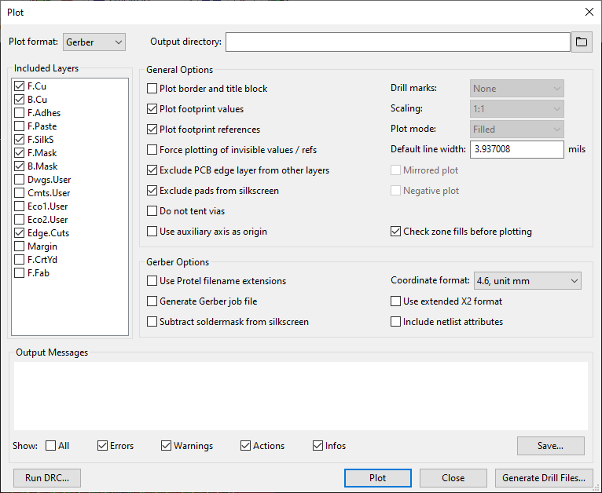
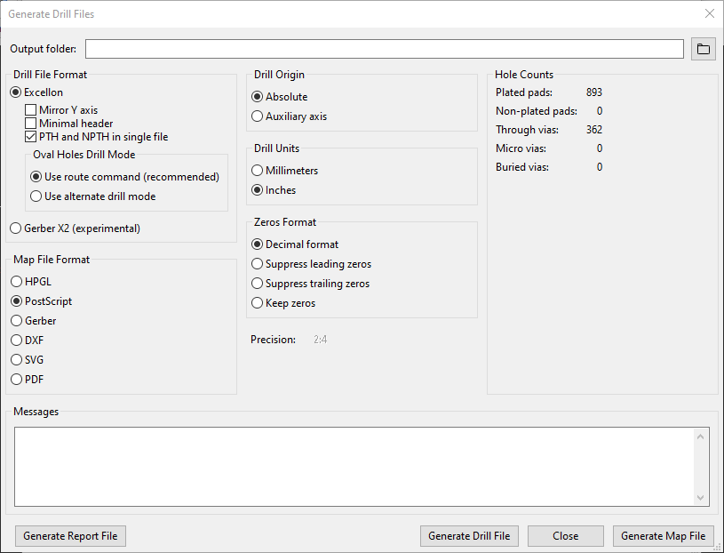

# TS2 PCB project

This is a Kicad project for the Teesside TS2 single board computer
from the book "Microprocessor Systems Design - 68000 Hardware,
Software, and Interfacing", third edition, by Alan Clements.

This is a modified version that simplifies the design by removing
circuitry that is not needed for operation as a single board computer.
Specifically, removed was:

- backplane interface and associated buffering.

- interrupt priority encoding and acknowledge circuitry.

- line drivers and receivers for serial ports (FTDI USB to serial
  adaptors are used instead) and support for host/terminal transparent
  mode. This also removes the need for +12V/-12V power supplies.

This is version 2.1 that makes the following additional changes:

- The hard to obtain 25LS2548 chip is replaced by more commonly
  available parts.

- The hard to obtain MC14411 baud rate generator is replaced by a
  smaller, simpler circuit using the more easily obtained 74HC4060.

See more details on my blog at http://jefftranter.blogspot.ca/

## PCB printing
For your convenience, a [v2.1-gerbers.zip](v2.1-gerbers.zip) zip file is included here that you can directly feed to a printing facility. It includes the gerber files for the copper tracings, soldermasks, silk screens, drill file and other printing requirements. 

The individual gerber files are included (duplicated) as well in this directory for direct inspection in KiCad. Don't forget to update the files in the zip if you export using different settings.

The files were generated with KiCad v5.14 using the following settings. Note that your PCB manufacturer may require other settings. Check their site for the proper gerber and drill file export settings - don't use a printing facility that doesn't specify how to export the files!

### Gerber export settings

### Drill file export
 
